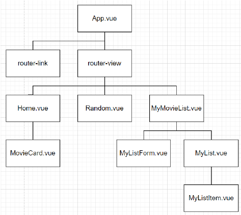

# Simple Movie Website

by Tae Hun KIM, 

partnered with Dong Jun LEE

      


1. [Build-process (페어 프로그래밍)](#build-process (페어 프로그래밍))
2. [Acquired knowledge](#acquired-knowledge)
3. [Challenges](#challenges)
4. [Takeaway](#takeaway)

<hr>
<br>
<br>
<br>


## :triangular_flag_on_post: Goal Implementations

<hr>


1. Vue.js 를 활용한 Single Page Application 제작
   - 영화정보 출력
   - 랜덤 추천 영화 출력
   - 나중에 볼 영화 Todo 리스트 생성
2. Single File Component 구조 활용하여 웹사이트 구현
   - vuex 활용하여 상태정보 중앙 집권형으로 관리



<hr>

<br>

<br>

<br>


## :handshake:  Build-process (페어 프로그래밍)

<hr>


1. 가장 먼저 TMDB API 에서 영화 정보들을 가져오는 기능을 구현했습니다.

   서버가 켜지고 웹사이트의 Home 으로 접속하게 되면 자동으로 영화 정보를 가져옵니다.

   ```javascript
   // Home.vue
   ...
   created: function () {
       this.$store.dispatch('loadMovieCards')
     },
   ...
   ```

   ```javascript
   // index.js
   state: {
       movieCards: [],
       ...
   	},
   mutations: {
       LOAD_MOVIE_CARDS: function (state, results) {
         state.movieCards = results
       ...
       },
   actions: {
       loadMovieCards: function ({ commit }) {
         axios({
           method: 'get',
           url: 'https://api.themoviedb.org/3/movie/top_rated',
           params: {
             api_key: '##########################',
             language: 'ko-KR',
           }
         })
         .then((res) => {
           // console.log(res)
           commit('LOAD_MOVIE_CARDS', res.data.results)
         })
   ...
   ```

   <br>

   vuex의 `mapStore` 를 활용해서 `state`안의 상태정보를 가져와, 각 영화 리스트를 화면에 출력 시켰습니다.

   ```vue
   // Home.vue
   ...
   <movie-card
         v-for="movieCard in movieCards"
         :key="movieCard.id"
         :movieCard="movieCard"
       ></movie-card>
   ```

   ```javascript
   ...
   import { mapState } from 'vuex'
   export default {
       computed: {
           ...mapState(['movieCards'])
         }
   ...
   ```

   ```vue
   // MovieCard.vue
   ...
   
       <h2>{{ movieCard.title }}</h2>
       <h3>{{ movieCard.overview }}</h3> 
   ...
   ```

   ```javascript
   ...
   computed: {
       movieImageSrc: function () {
         return `https://image.tmdb.org/t/p/original/${this.movieCard.poster_path}`
       }
   ...
   ```

   <br>

2. 다음으로 나중에 볼 영화 todo 리스트를 구현했습니다.

   먼저, 영화 todo 리스트 화면을 구성하였습니다.

   ```vue
   // MyMovieList.vue
   ...
   <h1>MyMovieList</h1>
       <my-list-form></my-list-form>
       <my-list></my-list>
   ...
   ```

   다음으로 보고싶은 영화를 입력하고 'Add' 버튼을 누르거나 엔터키를 치면 입력 내용이 화면상에 저장되는 기능을 구현했습니다.

   ```vue
   // MyListForm.vue
   ...
   <h1>MyListForm</h1>
       <input type="text" v-model.trim="movieTitle" @keypress.enter="createMyList">
       <button @click="createMyList">Add</button>
   ...
   ```

   ```javascript
   export default {
     name: 'MyListForm',
     data: function () {
       return {
         movieTitle: '',
       }
     },
     methods: {
       createMyList: function () {
         const movieItem = {
           title: this.movieTitle
         }
         if (this.movieTitle) {
           this.$store.dispatch('createMyList', movieItem)
         }
         this.movieTitle = ''
       }
     }
   }
   ```

   ```vue
   // MyList.vue
   ...
   <my-list-item
           v-for="(title, idx) in movieTitle"
           :title="title"
           :key="idx"
         ></my-list-item>
   ...
   ```

   ```javascript
   ...
   computed: {
       ...mapState([
         'movieTitle'
       ])
     }
   ...
   ```

   ```vue
   // MyListItem.vue
   ...
     <div>
       <p>{{ title.title }}</p>
     </div>
   </template>
   
   <script>
   export default {
     name: 'MyListItem',
     props: {
       title: Object,
     }
   }
   ...
   ```

<hr>
<br>
<br>
<br>


## :memo:  Acquired knowledge 

<hr>


#### Vue-router 플러그인 이해

- router를 활용 함으로서 SPA 의 단점인 페이지간의 이동이 있는지에 대한 여부를 보여줄 수 있었습니다.

  ```javascript
  // router/index.js
  ...
  Vue.use(VueRouter)
  
  const routes = [
    {
      path: '/',
      name: 'Home',
      component: Home
    },
    {
      path: '/random',
      name: 'Random',
      component: Random
    },
    {
      path: '/my-movie-list',
      name: 'MyMovieList',
      component: MyMovieList
    },
  ]
  ...
  ```

<br>

#### Vuex 이 대한 이해도 Up

- 단방향성 상태정보의 흐름을 따르던 기본적인 Vue.js에서 벗어나서, 깊은 컴포넌트 트리를 가지는 프로젝트에서 유용하게 쓰일 수 있는 Vuex의 중앙집권형 상태정보관리로 이번 프로젝트를 구현해보았습니다.

  확실히 느꼈던건, 컴포넌트 트리의 깊이가 얕은 경우에는, 굳이 vuex를 쓰지 않는게 오히려 더 코드의 가독성이 올라가지 않을까 생각했습니다.

  ```javascript
  Vue.use(Vuex)
  export default new Vuex.Store({
    state: {
      movieCards: [],
      randomMovieCard: [],
    },
    mutations: {
      LOAD_MOVIE_CARDS: function (state, results) {
        ...
      },
      LOAD_RANDOM_MOVIE: function (state, movie) {
        ...
      }
    },
    actions: {
      loadMovieCards: function ({ commit }) {
        axios({
          ...
          }
        })
        .then((res) => {
          commit('LOAD_MOVIE_CARDS', res.data.results)
        })
      },
      loadRandomMovie: function ({ commit }) {
        commit('LOAD_RANDOM_MOVIE', randomMovie)
        ...
      }
    },
  ```

  

<hr>
<br>
<br>
<br>


## :fire:  Challenges

#### 1. Random 영화 추천 구현


   - TMDB api 에서 가져온 영화 정보들에서 하나의 영화 정보를 추출하여 해당 정보의 제목, 줄거리, 그리고 포스터 이미지를 화면에 출력하는 코드를 구현하려 했습니다.

     하지만 `store/index.js` 에 있는 상태 정보에 접근하는 방법을 끝내 제대로 이해하지 못한 채 프로젝트를 마무리 하게 되었습니다.

     <br>

     나중에서야 다른 동기들에게 물어봐 문제의 원인을 찾게 되었습니다만, 시간이 부족하여 해당 내용을 프로젝트에는 반영하지 못했습니다.

     문제의 원인으로서는, `mapState`를 제대로 활용하지 못한것이었습니다. 

     

<hr>
<br>
<br>


<br>


## :shopping_cart:  Takeaway

<hr>


이번에는 1주간 학습 내용을 복습하듯이 함께 처음부터 끝까지 웹페이지 구현을 진행하였습니다.

비록 프로젝트는 미완성으로 끝났지만, 수만은 에러들고 마주한 만큼, 제 파트너이자 드라이버 역할을 맡아주셨던 동준님과 함께 성장할 수 있었던 프로젝트가 아니었나 생각합니다.

몇번의 에러는 구글링으로 해결이 된것으로 보아, 이번 프로젝트를 통해 다시한번 구글링의 중요성, 그리고 JavaScript의 어려움을 몸소 느꼈습니다. 그리고 동준님께 도움을 많이 드리지 못한것에 대한 미안함도 느꼇습니다. 개발자는 거의 대부분이 혼자서 작업을 하지 않는다 배웠습니다. 앞으로 함께 작업을 하게될 분들께 민폐가 되지 않기 위해서라도 열심히 JavaScript와 구글링을 연습해야된다 생각이 들었습니다.

동준님 수고하셨습니다! 
